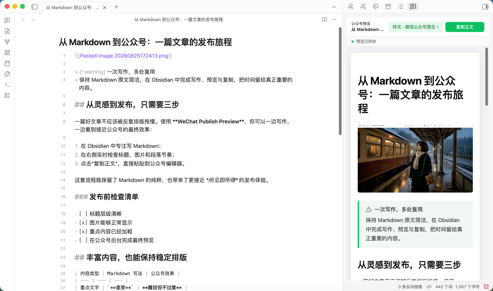

[English](README.md) | 简体中文

# 📝 WeChat Publish Preview

让微信公众号排版留在 Obsidian 里。

WeChat Publish Preview 是一款面向公众号写作者的 Obsidian 桌面端插件。它会在右侧边栏实时呈现当前 Markdown 笔记的公众号样式，编辑区与预览区支持按段落双向滚动同步；排版完成后，可一键复制富文本并直接粘贴到公众号草稿编辑器。

从写作、预览到复制，整个过程都在 Obsidian 内完成。复制时，本地图片会在内存中自动转换为 Base64 并随正文写入剪贴板，无需图床；网络图片、数学公式和 Mermaid 也会尽量转换为可复制的内容。所有转换都不会写回原始笔记，也不需要配置公众号 AppID 或 AppSecret。



## English summary

WeChat Publish Preview provides a live, WeChat-ready Markdown preview in the right sidebar, bidirectional scrolling between the editor and preview, and one-click rich-text copy for the WeChat Official Account draft editor. Local images are converted to Base64 in memory, so no image host is required and the original Markdown stays clean. See the [full English README](README.en.md) for installation and usage details.

## 🚀 核心能力一览

- **实时公众号预览**：编辑当前笔记时，右侧预览约 200ms 后自动刷新，无需先保存。
- **30 套排版样式**：在预览顶部打开样式下拉框，即时切换经典、潮流和更多风格三组主题，选择会自动记住。
- **双向滚动同步**：无论滚动编辑区还是预览区，另一侧都会按正文段落跟随，长文修改时不容易丢失位置。
- **一键复制到公众号草稿**：点击“复制正文”，即可将排版后的富文本粘贴到微信公众号后台的草稿编辑器。
- **图片转 Base64，无需图床**：本地图片会在复制时自动内嵌到富文本中，不用先上传图床；转换只发生在内存副本中，不修改 Markdown 和附件。
- **Callout 符号与主题联动**：提示、警告等 Callout 的类型符号会保留在预览中，区块配色和版式跟随当前排版样式；复制时自动转换为微信兼容的静态结构。
- **主题色 TODO 勾选框**：任务列表不再沿用 Obsidian 默认紫色，勾选态、未勾选态以及复制结果都会使用当前排版样式的强调色。
- **适配 Obsidian 内容**：支持 WikiLink 图片、相对路径图片、Callout、任务列表、脚注、数学公式和 Mermaid。
- **本地优先**：不收集遥测，不读取公众号凭据，不自动上传文章或提交草稿。

## 💡 功能亮点

### 1. 所见更接近所得

预览和剪贴板内容共用同一套微信兼容渲染流程。标题、段落、引用、代码块、表格、图片等关键样式会以内联 CSS 写入复制结果，减少粘贴到公众号编辑器后的样式偏差。

### 2. 双向滚动同步

无论滚动左侧 Markdown 编辑区还是右侧公众号预览，另一侧都会跟随到对应段落。插件使用正文锚点进行定位，而不是只按整篇文章的滚动百分比粗略换算。

### 3. 本地图片无需图床

插件支持 Obsidian 的 `![[Wiki Link]]`、相对路径图片、Vault 附件和网络图片。复制时，本地图片会读取为 Base64 Data URL，与排版后的富文本一起写入剪贴板，直接粘贴到公众号草稿编辑器即可，无需配置图床。网络图片会尝试下载并转换；单张图片处理失败不会中断全文复制，并会列出警告。

### 4. 公式与 Mermaid 可复制

数学公式和 Mermaid 图表会先在 Obsidian 中渲染，复制前再转换为适合微信公众号编辑器的图片，降低 SVG、MathML 或复杂样式被过滤后损坏的概率。

### 5. 30 套公众号排版样式

内置 Mac、Claude、微信原生、NYT、Medium、Stripe、少数派、Dracula、水墨、Cyberpunk 等 30 套 Raphael Publish 风格。点击预览顶部的“样式”按钮即可按分组选择，预览和复制结果始终使用同一套样式；插件会记住最近一次选择。

### 6. Callout 符号与主题保持一致

Obsidian 的提示、警告、危险等 Callout 会在预览中保留对应的类型符号，标题、正文、边框和背景继承当前主题的引用样式。复制到公众号时，折叠控件会被移除，Callout 会转换为稳定的静态语义区块，避免深色主题下出现符号或文字不可见。

### 7. TODO 勾选框跟随主题色

公众号预览使用插件自绘的任务勾选框，不受 Obsidian 默认紫色复选框影响。已完成项使用当前主题的强调色填充，未完成项使用同色边框；复制后的勾选状态和颜色保持一致。

## 📖 使用方法

1. 在 Obsidian 中打开一篇 Markdown 笔记。
2. 点击左侧功能区的“打开公众号预览”图标；也可以按 `Cmd/Ctrl + P`，运行“打开公众号预览”。
3. 如需更换排版，点击预览顶部的“样式”按钮并从下拉框中选择。
4. 继续编辑或滚动笔记，右侧面板会实时更新并同步位置。
5. 点击预览顶部的“复制正文”，再粘贴到微信公众号后台的正文编辑区。

> 插件会在预览中使用 Markdown 文件名生成文章标题，但复制时会移除这个自动标题。公众号后台的标题输入框仍需手动填写。

## 🧩 支持范围

| 内容 | 预览 | 复制到公众号 |
| --- | :---: | :---: |
| 标题、段落、强调、链接 | ✅ | ✅ |
| 有序/无序列表、任务列表 | ✅，TODO 跟随主题色 | ✅，保留状态与主题色 |
| 引用、Callout、脚注 | ✅，保留 Callout 类型符号 | ✅，转换为静态兼容结构 |
| 代码块、表格 | ✅ | ✅ |
| Obsidian 本地及相对路径图片 | ✅ | Base64 内嵌，无需图床 |
| 网络图片 | ✅ | 尝试转为 Base64；失败时警告 |
| 数学公式、Mermaid | ✅ | 转换为图片 |

当前版本不提供自定义主题导入、公众号账号配置或自动提交草稿箱功能。

## 🚀 安装

### 方式一：Obsidian 社区插件市场（推荐 ⭐）

1. 打开 Obsidian 的“设置” → “社区插件”。
2. 启用社区插件，然后点击“浏览”。
3. 搜索 `WeChat Publish Preview`。
4. 点击“安装”，安装完成后点击“启用”。

### 方式二：通过 BRAT 安装

1. 安装并启用 [BRAT](https://github.com/TfTHacker/obsidian42-brat)。
2. 打开命令面板，运行 `BRAT: Add a beta plugin for testing`。
3. 输入仓库：`joahyi-ai/WeChat-Publish-Preview`。
4. 安装完成后，在“设置” → “社区插件”中启用 WeChat Publish Preview。

### 方式三：从 GitHub Release 手动安装

1. 前往 [GitHub Releases](https://github.com/joahyi-ai/WeChat-Publish-Preview/releases) 下载 `main.js`、`manifest.json` 和 `styles.css`。
2. 将三个文件放入以下目录：

   ```text
   <Vault>/.obsidian/plugins/wechat-publish-preview/
   ```

3. 重启 Obsidian 或重新加载应用，然后在“设置” → “社区插件”中启用插件。

## 🔐 隐私与权限说明

WeChat Publish Preview 默认只在本地工作，不收集遥测，也不会自动上传笔记。

- **笔记内容**：仅在本机 Obsidian 中读取和渲染。
- **本地文件**：仅在处理当前笔记引用的 Vault 图片时读取。
- **网络请求**：仅当文章引用网络图片时访问对应图片地址。
- **剪贴板**：仅在你主动点击复制按钮或运行复制命令时写入。
- **公众号账号**：不读取登录状态，不需要 AppID、AppSecret 或 Access Token。

## ❓ 常见问题

### 为什么图片能预览，复制时仍可能转换失败？

显示图片只需要加载资源；内嵌图片还需要读取二进制数据。部分图床会限制跨域读取、防盗链或临时授权。插件会继续复制正文，并列出未能完全处理的图片。

### 为什么没有自动填写公众号标题？

网页剪贴板无法把一次粘贴同时分发到标题和正文两个输入框，因此插件只复制正文，标题需要手动填写。

### Base64 会写进 Markdown 吗？

不会。转换只发生在本次复制使用的内存副本中，原始 Markdown 和附件不会被修改。

## 🗒 Changelog

### 1.1.1 — 2026-08-27

- 将仓库主 `README.md` 改为完整英文说明，中文文档移至 `README.zh-CN.md`，以满足 Obsidian 社区目录的英文文档要求。

### 1.1.0 — 2026-08-26

- 新增 30 套 Raphael Publish 排版样式，支持分组选择、即时预览、复制同步和记忆上次选择。
- Callout 类型符号在预览中保留并继承当前主题配色；复制时转换为微信兼容的静态结构。
- TODO 勾选框改为插件自绘，已完成和未完成状态均跟随当前主题强调色，并在复制结果中保持一致。
- 改进深色主题的代码高亮、引用/Callout 可读性、列表层级和主题字体保留。
- 更新 README 实例截图，展示新版样式选择与主题化 Callout 效果。

### 1.0.4 — 2026-08-25

- 完善市场文档，重点说明编辑区/预览区双向滚动同步、Base64 图片内嵌和公众号富文本复制流程。

### 1.0.3 — 2026-08-25

- 调整插件描述以符合社区目录规则，并在主 README 中加入英文摘要。

### 1.0.2 — 2026-08-25

- 重写中英文使用文档，加入真实 Obsidian 截图并更新市场展示说明。

### 1.0.1 — 2026-08-25

- 按社区审核要求统一插件 ID、名称和最低 Obsidian 版本，修复官方 ESLint 问题并补充英文文档。

### 1.0.0 — 2026-08-25

- 首个正式版本：提供公众号实时预览、双向滚动、一键复制、Base64 图片、公式/Mermaid 转换，以及表格、代码块、列表、引用、Callout 和脚注支持。

## 🛠 开发

```bash
pnpm install
pnpm verify
```

- `pnpm test`：运行自动化测试。
- `pnpm build`：类型检查并生成 `main.js`。
- `pnpm deploy:test`：安装当前构建到仓库内的 `test-vault`。
- `pnpm verify`：依次执行检查、测试、构建和测试 Vault 部署。

## 🤝 贡献

欢迎通过 [Issues](https://github.com/joahyi-ai/WeChat-Publish-Preview/issues) 反馈问题，也欢迎提交 Pull Request。

## 🙏 致谢

公众号主题库和部分微信兼容策略改编自 MIT 许可的 [Raphael Publish](https://github.com/liuxiaopai-ai/raphael-publish)，完整许可信息见 [THIRD_PARTY_NOTICES.md](THIRD_PARTY_NOTICES.md)。

README 的内容组织和安装说明参考了 [Wechat Converter](https://github.com/DavidLam-oss/obsidian-wechat-converter)。

## 📄 许可证

[MIT License](LICENSE)
